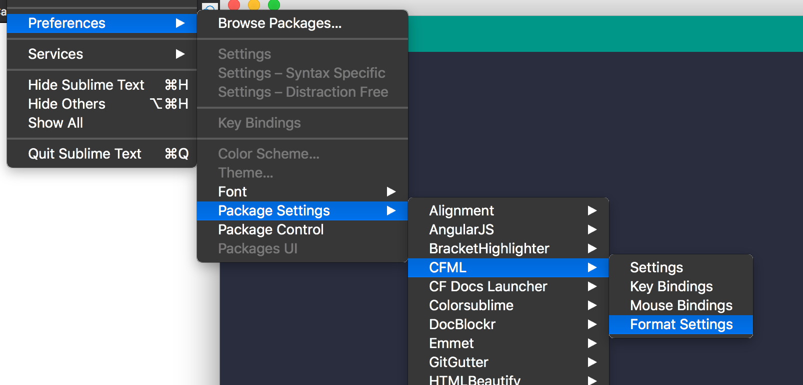

# Ortus Coding Style Guides

This repository includes all of the Ortus coding style guides, linter and formatting configurations.

## Guides

* [ColdFusion](guides/coldfusion.md)
* [CSS-SASS](guides/css-sass.md)
* [Database](guides/database.md)
* [JavaScript](guides/javascript.md)
* [Security](guides/security.md)


## Linters

* [CFlint](linters/.cflintrc) - Leverages the cflint project (`box install commandbox-cflint`)
* [CFlint ColdBox Handlers](linters/.cflintrc-handlers) - Specific linting of ColdBox Handlers
* [Editorconfig](linters/.editorconfig) - Leverages the EditorConfig Plugins for your IDE
* [ESLint](linters/.eslintrc.json) - ESLinting of JavaScript and Vue files.
* [JSBeautify](linters/.jsbeautifyrc)
* [JSHint](linters/.jshintrc)
* [SASS](linters/.sass-lint.yml)

## Formatters

* [ColdFusion - CFFormat](formatters/.cfformat.json)
* [ColdFusion - Submlime](formatters/cfml_format.sublime-settings)
* [Java - Eclipse/VSCode](formatters/ortus-java-style.xml)


## IDE Automatic Coding Standards

We also provide ways to apply our formatting rules automatically via modern IDEs.

### CommandBox Formatting

Start off by installing the cfformat CommandBox package: `box install commandbox-cfformat`.  Then in the root of your application if you have a `box.json` open it.  If you don't, then initialize your application as a CommandBox package: `box init`.  Then open the file and look for a `scripts` section, if you don't have one, then add it.  We will create three scripts to format your source code:

* `format` : Format all the files/directories you want
* `format:watch` : Start a watcher for all the files/directories you want and if a save is detected, automatically format the changed files.
* `format:check` : Verifies if the watched files/directories adhere to your style guides.

```js
scripts : {
    "format" : "cfformat run handlers/,interceptors/,models/,test-harness/tests/specs,ModuleConfig.cfc --overwrite",
    "format:watch" : "cfformat watch handlers/,interceptors/,models/,test-harness/tests/specs,ModuleConfig.cfc ./.cfformat.json",
    "format:check" : "cfformat check handlers/,interceptors/,models/,test-harness/tests/specs,ModuleConfig.cfc",
}
```

Then you can run a watcher: `box run-script format:watch` and everytime you save a change in the files being watched, the formatter will automatically format the CFML code.


### VSCode ESLint

We are using ESLint as our standards for formatting and linting for JavaScript and Vue files.  You can follow this guide to setup your VSCode editor for formatting and linting: [Setup VSCode](https://www.digitalocean.com/community/tutorials/linting-and-formatting-with-eslint-in-vs-code)


### Sublime

If you use Sublime as your IDE, you can install the `CFML` package and use the built-in formatter to help you format CFML files according to our standards.  Just open the **Format Settings** and paste in the [Sublime Settings](formatters/cfml_format.sublime-settings) contents. Then you can use the shortcut for it according to OS to execute it. You can read it here: https://github.com/jcberquist/sublimetext-cfml#code-formatting



The CFML Format operation is a manual command in Sublime by default. To make it automatic, install the "Hooks" (https://packagecontrol.io/packages/Hooks) plugin for Sublime and then add the following hook to your Syntax specific settings for CFML. To get to the Syntax specific settings, open a CFM or CFC file in Sublime then select the menu item Sublime Text > Preferences > Syntax - Specific Settings

```json
// These settings override both User and Default settings for the cfml
syntax
{
 "on_pre_save_language": [
     {
         "command": "cfml_format",
         "args": {
        "current_method": false
}, }
] }
```


---

**Copyright Ortus Solutions Corp**

If otherwise noted, this content is property of Ortus Solutions, Corp.

> Soli Deo Gloria
