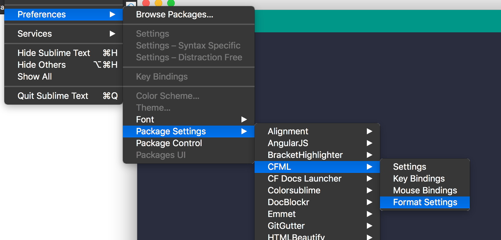

# Ortus Coding Style Guides

This repository includes all of the Ortus coding style guides.

* [JavaScript](javascript.md)
* [ColdFusion](coldfusion.md)
* [Database](database.md)
* [Security](security.md)
* [EditorConfig](.editorconfig) - Leverages the EditorConfig Plugins for your IDE
* [JSHintRC](.jshintrc) - Leverages JSHint for your IDE
* [CFLint](.cflintrc) - Leverages CFLint to lint from the IDE or CLI
* [ESLint](.eslintrc.js) - Leverages EcmaScript lint

## IDE Automatic Coding Standards

### Sublime

If you use Sublime as your IDE, you can install the `CFML` package and use the built-in formatter to help you format CFML files according to our standards.  Just open the **Format Settings** and paste in the [Sublime Settings](cfml_format.sublime-settings) contents. Then you can use the shortcut for it according to OS to execute it. You can read it here: https://github.com/jcberquist/sublimetext-cfml#code-formatting



The CFML Format operation is a manual command in Sublime by default. To make it automatic, install the "Hooks" (https://packagecontrol.io/packages/Hooks) plugin for Sublime and then add the following hook to your Syntax specific settings for CFML. To get to the Syntax specific settings, open a CFM or CFC file in Sublime then select the menu item Sublime Text > Preferences > Syntax - Specific Settings

```json
// These settings override both User and Default settings for the cfml
syntax
{
 "on_pre_save_language": [
     {
         "command": "cfml_format",
         "args": {
        "current_method": false
}, }
] }
```

### VSCode

We are using ESLint as our standards for formatting and linting for JavaScript and Vue files.  You can follow this guide to setup your VSCode editor for formatting and linting: [Setup VSCode](https://www.digitalocean.com/community/tutorials/linting-and-formatting-with-eslint-in-vs-code)

- https://www.digitalocean.com/community/tutorials/linting-and-formatting-with-eslint-in-vs-code


---

**Copyright Ortus Solutions Corp**

If otherwise noted, this content is property of Ortus Solutions, Corp.
